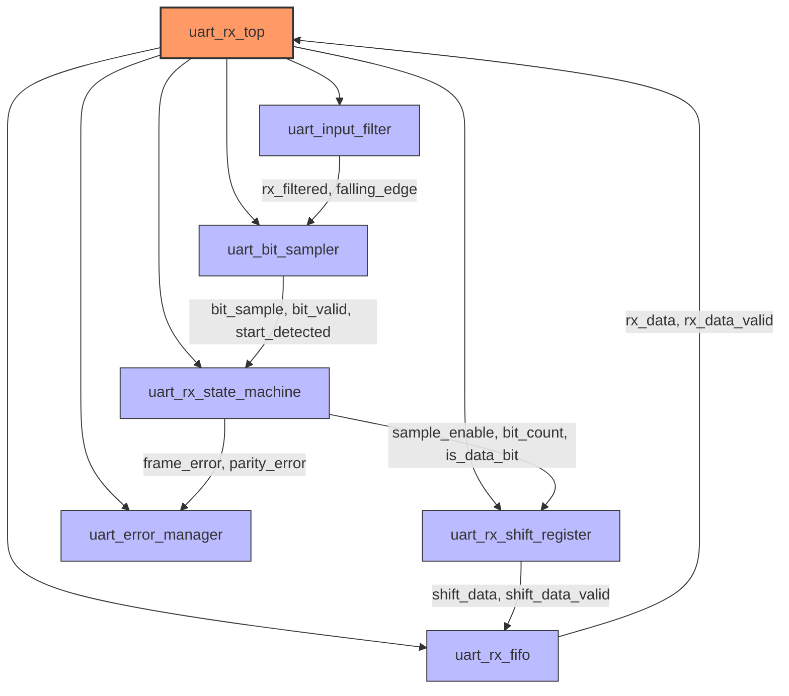
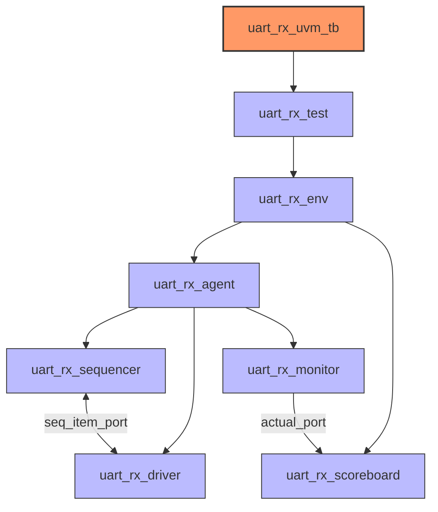

# UART Receiver (UART-RX)

A configurable UART receiver design with UVM (Universal Verification Methodology) testbench for comprehensive verification.

## RTL Architecture

The UART receiver consists of several key components:



### Key Components:

- **uart_rx_top**: Top-level module integrating all components
- **uart_input_filter**: Filters and synchronizes the RX input signal
- **uart_bit_sampler**: Samples the input signal at appropriate times
- **uart_rx_state_machine**: Controls the UART protocol state
- **uart_rx_shift_register**: Collects incoming serial bits into parallel data
- **uart_error_manager**: Detects and manages error conditions
- **uart_rx_fifo**: Buffers received data

### Features:

- Configurable data width (5-9 bits)
- Configurable parity (none, odd, even, mark)
- One or two stop bits
- MSB or LSB first reception
- Error detection (framing, parity, break, timeout)
- 16x oversampling for robust reception
- FIFO buffer with programmable depth

## UVM Testbench Architecture

The UVM verification environment follows a standard structure:



### Verification Components:

- **sequence_items**: Contains the transaction items
- **sequences**: Test scenarios (basic data, multiple data, error conditions)
- **driver**: Converts transactions to pin-level activity
- **monitor**: Observes and collects pin-level activity
- **scoreboard**: Validates received data against expected values

### Test Cases:

1. Basic data reception
2. Multiple data reception
3. Various bit patterns (0x55, 0xAA, 0x00, 0xFF)
4. Framing error detection
5. Break condition detection

## Directory Structure

```
uart-rx/
├── scripts/
│   ├── run_sim.tcl       # Simulation script
│   └── view_wave.tcl     # Waveform viewer script
├── src/
│   ├── rtl/              # RTL design files
│   └── tb/               # Testbench files
│       ├── components/   # UVM components
│       ├── interface/    # Interface definition
│       ├── package/      # UVM package
│       ├── sequence_items/
│       ├── sequences/    # Test sequences
│       ├── tests/        # UVM tests
│       └── top/          # Testbench top module
└── README.md             # This file
```

## How to Use

### Running Simulation

To run the simulation:

```bash
cd uart-rx
vivado -mode batch -source scripts/run_sim.tcl
```

This will:
1. Compile all RTL and testbench files
2. Run the simulation
3. Save waveform data
4. Move log files to a `logs` directory

### Viewing Waveforms

To view the generated waveforms:

```bash
vivado -source scripts/view_wave.tcl
```

### Configuration Parameters

The UART receiver can be configured through parameters:

```systemverilog
uart_rx_top #(
  .CLK_FREQ_HZ(50_000_000),     // System clock frequency
  .DEFAULT_BAUD_RATE(115200),   // Default baud rate
  .MAX_DATA_BITS(9),            // Maximum data bits support
  .FIFO_DEPTH(16)               // FIFO buffer depth
) dut (
  // Ports...
);
```

Runtime configuration is available through input ports:
- `baud_rate`: Configurable baud rate
- `data_bits`: Number of data bits (5-9)
- `parity_mode`: Parity mode selection (0=none, 1=odd, 2=even, 3=mark)
- `stop_bits`: Stop bits configuration (0=1 stop bit, 1=2 stop bits)
- `lsb_first`: Bit order (0=MSB first, 1=LSB first)
