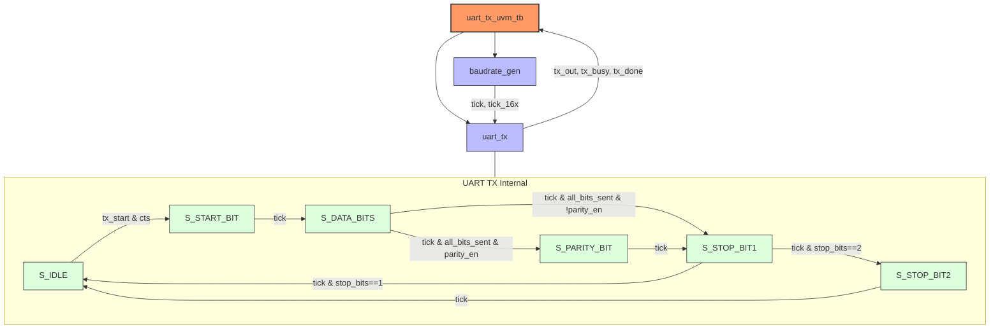
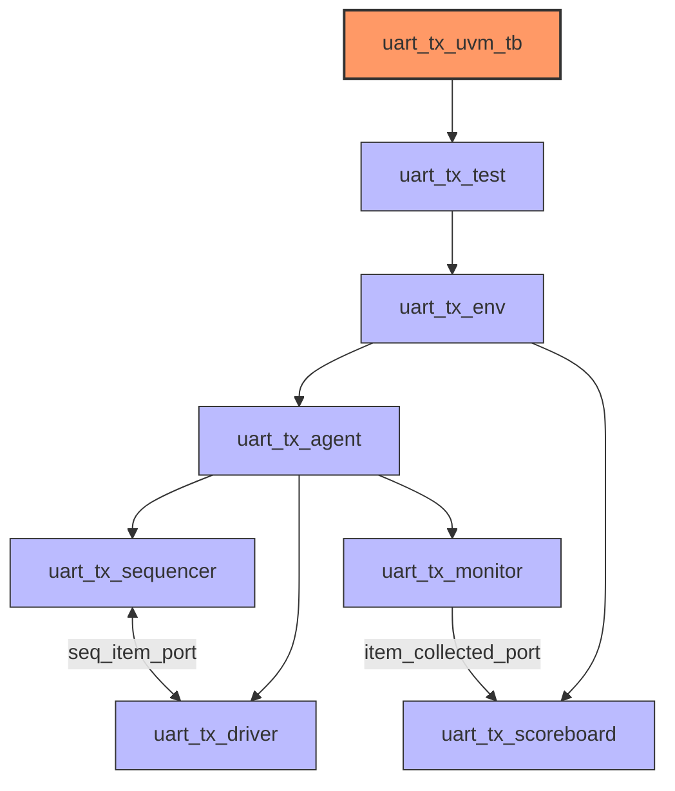

# UART Transmitter (UART-TX)

A configurable UART transmitter design with UVM (Universal Verification Methodology) testbench for comprehensive verification.

## RTL Architecture

The UART transmitter consists of two primary components and an internal state machine:



### Key Components:

- **uart_tx**: Main transmitter module implementing the UART protocol
- **baudrate_gen**: Configurable baud rate generator supporting different clock frequencies

### Features:

- Configurable data width (default 8 bits)
- Configurable parity (none, odd, even)
- One or two stop bits
- Hardware flow control (CTS - Clear To Send)
- Programmable baud rate
- Built-in oversampling (16x for RX applications)

The transmitter implements a state machine that handles:
- Idle state (line high)
- Start bit (line low)
- Data bits (LSB first)
- Parity bit (if enabled)
- Stop bits (1 or 2)

## UVM Testbench Architecture

The UVM verification environment follows a standard structure:



### Verification Components:

- **sequence_items**: Contains the transaction items
- **sequences**: Test scenarios (basic transmission, flow control, etc.)
- **driver**: Converts transactions to pin-level activity
- **monitor**: Observes and collects pin-level activity
- **scoreboard**: Validates transmitted data

### Test Cases:

1. Basic transmission
2. Flow control test (CTS active/inactive)
3. Multiple sequential transmissions
4. CTS deasserted during transmission
5. Different data patterns (all zeros, all ones, alternating)

## Directory Structure

```
uart-tx/
├── scripts/
│   ├── run_sim.tcl       # Simulation script
│   └── view_wave.tcl     # Waveform viewer script
├── src/
│   ├── rtl/              # RTL design files
│   │   ├── baudrate_gen.sv
│   │   └── uart_tx.sv
│   └── tb/               # Testbench files
│       ├── components/   # UVM components
│       ├── interface/    # Interface definition
│       ├── package/      # UVM package
│       ├── sequence_items/
│       ├── sequences/    # Test sequences
│       ├── tests/        # UVM tests
│       └── top/          # Testbench top module
└── README.md             # This file
```

## How to Use

### Running Simulation

To run the simulation:

```bash
cd uart-tx
vivado -mode batch -source scripts/run_sim.tcl
```

This will:
1. Compile all RTL and testbench files
2. Run the simulation
3. Save waveform data
4. Move log files to a `logs` directory

### Viewing Waveforms

To view the generated waveforms:

```bash
vivado -source scripts/view_wave.tcl
```

### Configuration Parameters

The UART transmitter can be configured through parameters:

```systemverilog
// Baudrate generator configuration
baudrate_gen #(
  .CLK_FREQ_HZ(50_000_000),  // System clock frequency
  .BAUD_RATE(115200),        // Desired baud rate
  .OVERSAMPLING(16)          // Oversampling factor (16x typical)
) baudgen (
  // Ports...
);

// UART transmitter configuration
uart_tx #(
  .DATA_BITS(8),             // Number of data bits
  .PARITY_EN(1),             // Enable parity (0=disabled, 1=enabled)
  .PARITY_TYPE(0),           // Parity type (0=even, 1=odd)
  .STOP_BITS(1)              // Number of stop bits (1 or 2)
) dut (
  // Ports...
);
```

### Operation

The transmitter operates with the following control signals:
- `tx_start`: Pulse to start transmission
- `cts`: Clear To Send (flow control)
- `tx_data`: Data to transmit
- `tx_out`: Serial output
- `tx_busy`: Transmitter busy signal
- `tx_done`: Transmission complete signal

Flow control is supported through the CTS signal, allowing the receiver to pause transmission when it cannot accept more data.
